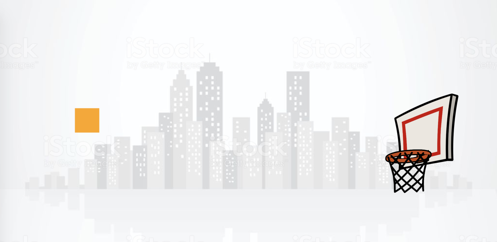

 

## Компьютерная графика

## Задание
- [X] 1. Воспользоваться тэгом <**canvas**> для создания 2d-графики
- [X] 2. Применить метод **fillRect** для отрисовки пикселей
- [X] 3. Использовать метод **setInterval** для создания анимации

## Ссылки
- [Просмотреть файл](https://cdn.rawgit.com/SimonRussia/CG_lab01/05736cab/lab_01.html)
